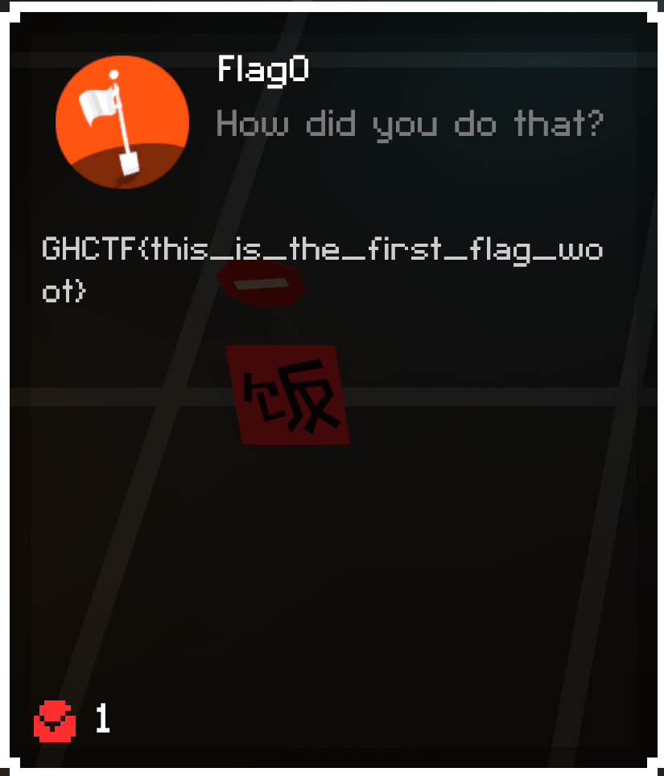

# Level 1

## Objective
Get the gun. For some reason, you have to kill the gun to get it. There's a turret in the corner of the room, and it shoots 
at you when you run into the gun in the middle of the room, and damages both of you. The gun has slightly more health than 
you, but you are armed with Cheat Engine!

## Solution
In Cheat Engine, we will start by doing a scan for `Scan Type: Exact Value`, and `Value Type: All`. Make sure that your 
settings don't have Executable selected. A square in the checkbox means it will include memory with that permission in the 
scan, a check mark means it will only look for memory with that permission (so if writeable is checked and executable is 
checked, it will only find writeable executable memory). We do want to see writeable memory, though. 

Then we just want to search for our current hp. It's 100 at the start of the level, but if you already tested that the turret
works as intended, change the scan value to whatever your current hp is and hit `First Scan`. You might get a ton of matches, 
and it might even show nothing in the panel, but say `Found: 400,000` or something like that.
 

 

Don't be frightened, though. We are going to narrow that down. Cheat engine will only scan the addresses it found in the 
previous scan. You can even tell it to only compare to the first scan, if the situation calls for it. So, run into the gun
in the center of the room, and take some damage. Now let's change the scan value to your current health and hit `Next Scan`,
this time. This should narrow it down to a few results, and if you are lucky, just a single result. If the memory address
for the health is not obvious, just repeat the process until you narrow it down to one obvious result.

Double click the address and it will be saved to your `Address List`. If you click the check box, it will freeze that value,
and you can now bump into the gun without consequence!
 

 

You will need to jump to get the flag, and then open up the inventory (`i`) and get the actual flag!

Flag

GHCTF{this_is_the_first_flag_woot}  
 

