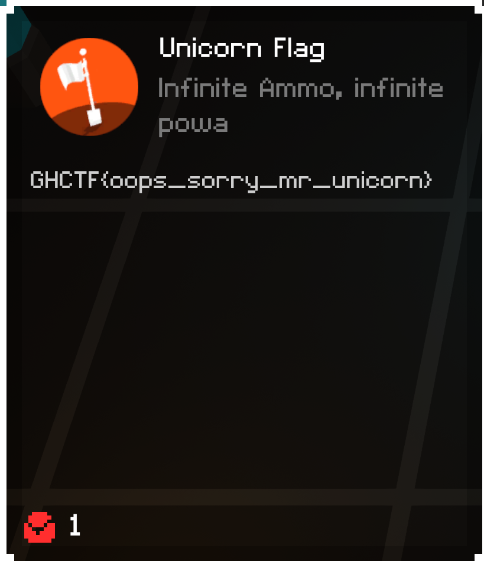

# Level 2

## Objective
Kill the Unicorn Raft! The Unicorn Raft has enough HP to absorb all of you bullets. If only there was a way to have infinite
bullets... hmmm...

## Solution
So, we start, again, looking for writeable memory. We start with the value of 10, and an exact match, fire the gun. Now
restart the level because you shot at the unicorn. Make sure you don't start the fight, unless you want to have the 
"Dark Souls" experience (or you enjoy pausing the game to scan). Just keep changing the value and scanning for exact match. If you want, you can also scan for
`Decreased Value` or `Changed Value`, but those scan methods will eliminate less results, on average. I usually use those
when I am unsure of the value I am looking for. For instance, if we wanted to, we could find the HP of the Unicorn Raft,
but in my experience, you end up running out of ammo before finding it. 

You might notice that you end up with 3 values, and they all seem to change when you shoot. You can select all three of 
these and drag them down too your `Address List`. You can right click and `Add to new group` and click "no" to "address 
support." Addr Support just gives you a memory address for that header, but this is just a group. You can rename this group 
`Ammo L2` by double clicking the description, and if you want to compact them, right click the top of the group and go to 
`Group config -> Hide children when deactivated`. Now you can click the check box on your new group to see the addresses.
Check all the boxes under this group to lock them. Notice you will lose ammo once, but will not continue to lose ammo
after subsequent shots. You can uncheck the boxes one-by-one to figure out which one is the real ammo, and then label it.
I labeled the other two "UI/Mirror?", as this is the best guess I can come up with. These are either values for the UI,
or they are redundant values that are part of a mirror. Could be wrong, though, just my guess.
 

 

Flag

GHCTF{oops_sorry_mr_unicorn}  
 

