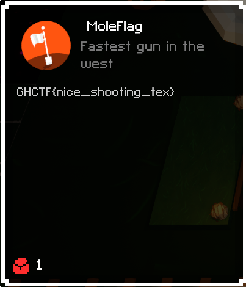

# Level 7

## Objective
They said no more cheating at the start of this level, but, I took care of that, in the beginning...

## Solution
This level announces that you can no longer cheat, and indeed, if you have not disabled the anticheat, this level WILL kill
your game. We took care of that in the preamble to this challenge, so, now let's get on with level 7, shall we? Inside the
Assembly, there is a `whackamole` class. I assume this is it, since it's a whackamole level. All we realy need to do is 
edit the CheckWin function to only take the path that returns `true`.
 

 
We just need to right click, and edit the IL code. All we need to do is press `N` on the keyboard after the IL Code screen
opens and then hit ok. The Method should just now show the entire body of the statement as the whole function, with `true`
as the return value.
 

 

Flag

GHCTF{nice_shooting_tex}  
 

