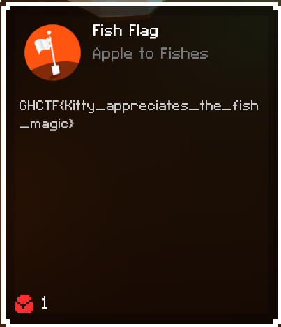

# Level 7

## Objective
They said no more cheating at the start of this level, but, I took care of that, in the beginning...

## Solution
This level announces that you can no longer cheat, and indeed, if you have not disabled the anticheat, this level WILL kill
your game. We took care of that in the preamble to this challenge, so, now let's get on with level 7, shall we? Inside the
Assembly, there is a `whackamole` class. I assume this is it, since it's a whackamole level. All we realy need to do is 
edit the CheckWin function to return true.
 

 
We just need to right click, change the method body to a stub, and edit the IL code. In the IL code, we have a `ldc.i4.0`
and then a return. We just need to change the first instruction to `ldc.i4.1` and now we have the function just returning
true, no matter what.
 

 

Flag

GHCTF{Kitty_appreciates_the_fish_magic}  
 

